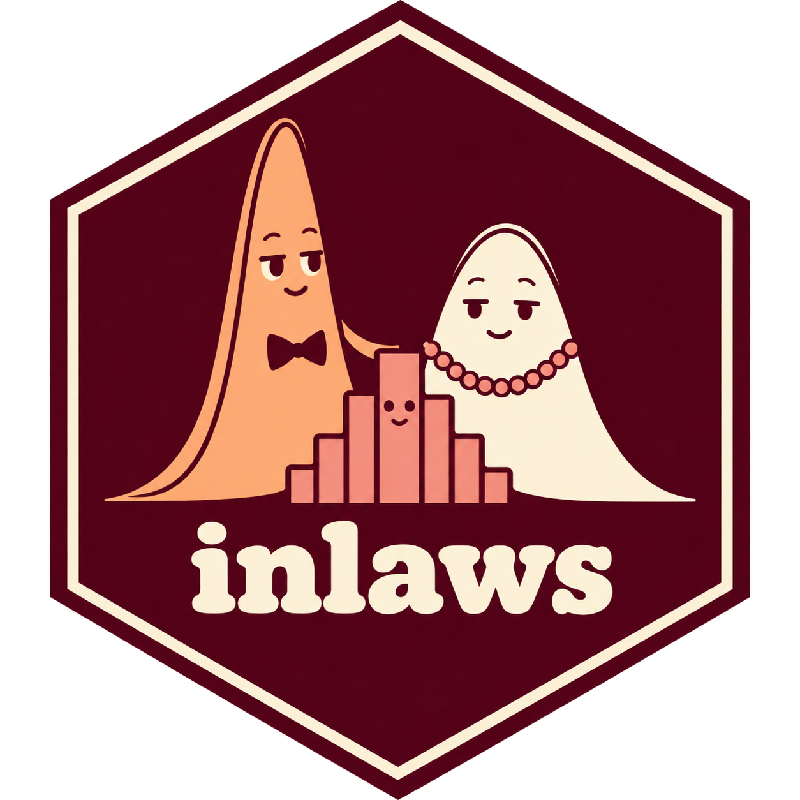

# inlaws 

[](https://github.com/gam-mafia/inlaws/actions/workflows/R-CMD-check.yaml)
[](https://github.com/gam-mafia/inlaws/actions/workflows/test-coverage.yaml)
[](https://github.com/gam-mafia/inlaws/actions/workflows/pkgdown.yaml)

Documentation: <https://gam-mafia.github.io/inlaws/>.

Additional distribution families for **mgcv**. This is a development package;
consult each family's help for parameterizations, limitations, and supported
fitting methods. Availability does not imply identical validation maturity.

See the [family compatibility vignette](https://gam-mafia.github.io/inlaws/articles/family-compatibility.html)
for the current `gam()`/`bam()` and smoothing-selection support matrix, or run
`vignette("family-compatibility", package = "inlaws")` after installing with
vignettes. Building the vignette requires the Quarto CLI and the R package
**quarto**.

| Response | Family constructors |
| --- | --- |
| Beta-binomial | `betabinomial()` |
| Censored gamma | `cgamma()` |
| Censored log-normal | `clognormal()`, `clognormalls()` |
| Conway-Maxwell-Poisson | `cmp()` |
| Cumulative-link ordinal | `cumulative_link()` |
| Dirichlet | `dirichlet()` |
| Dirichlet-multinomial | `dirmult()` |
| Generalized Poisson | `gp()` |
| Negative binomial location and size | `nbls()` |
| Ordered beta | `ordbeta()` |
| Zero-inflated / hurdle negative binomial | `zinb()`, `zanb()` |
| Generalized Pareto | `gpd()` |

```r
library(inlaws)

set.seed(1)
d <- data.frame(x = runif(300))
d$y <- rnbinom(300, mu = exp(1 + d$x), size = 3)
fit <- mgcv::gam(list(y ~ s(x, k = 6), ~ 1),
                 data = d, family = nbls(), method = "REML")
predict(fit, type = "response")
fit$family$rd(fitted(fit))
fit$family$qf(0.95, fitted(fit))
```

The package contains families and their distribution callbacks, without general
simulation or quantile wrappers for fitted models. Callback parameter scales and
matrix-response support differ by family; see its documentation. Mathematical
notes are under `inst/maths`, and optional external comparisons under
`inst/validation`. The existing mgcvUtils `clognorm()` and smooth constructors
are outside this package's scope.

## Development

From the repository's parent directory:

```sh
R CMD build inlaws
R CMD check --no-manual inlaws_0.0.0.9000.tar.gz
```

The base-R regression tests live in `tests/` and run during `R CMD check`.
Regenerate documentation with `roxygen2::roxygenise("inlaws")` after editing
roxygen comments. See `MIGRATION.md` for provenance and original attribution.

GitHub Actions runs `R CMD check` on Linux, macOS, and Windows. The coverage
workflow runs the base-R tests with **covr**, reports the percentage in the run
summary, and uploads XML, CSV, and RDS coverage reports as the `coverage`
artifact. No external coverage service or token is required.

Build the documentation locally with `pkgdown::build_site()` (requires
**pkgdown** and Quarto). The pkgdown workflow builds pull requests and uploads
a `pkgdown-preview` artifact; pushes to `main` build and deploy the site to
GitHub Pages. The repository's Pages publishing source must be **GitHub
Actions**. All three workflows can also be run manually from the Actions tab.
